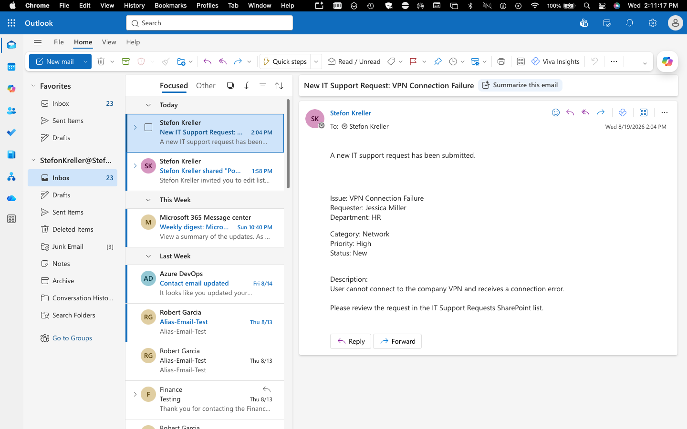
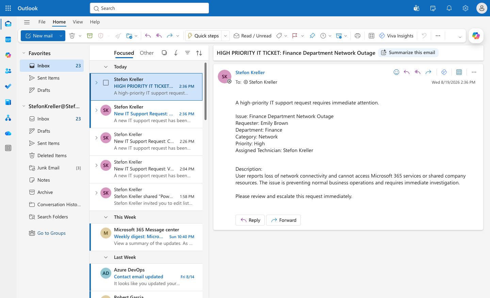
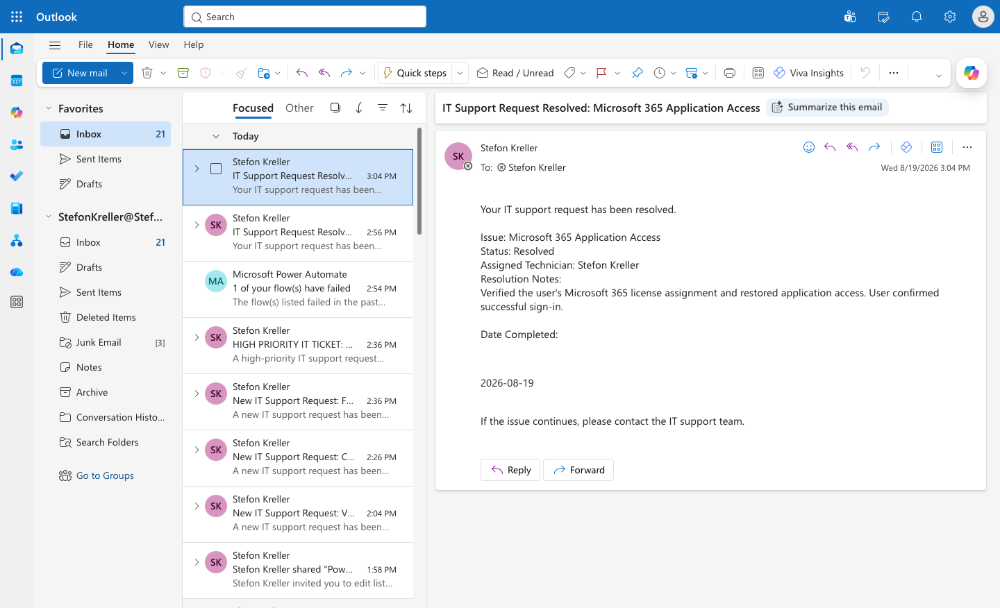

# SharePoint + Power Platform Support Lab

## Overview

This project demonstrates a hands-on Microsoft support environment built with **SharePoint Online, Power Apps, Power Automate, Microsoft Entra ID, and Outlook**.

The lab simulates an IT support workflow where users submit support requests, technicians manage and resolve tickets, high-priority incidents are automatically escalated, requesters receive status notifications, and access to support resources is controlled through Microsoft Entra ID and SharePoint permissions.

The project was designed to demonstrate practical skills used in:

- Microsoft 365 support
- SharePoint administration
- Power Platform support
- Identity and access management
- Permission management
- Workflow automation
- Help desk operations
- Technical troubleshooting
- Technical documentation

---

## Technologies Used

- Microsoft SharePoint Online
- Microsoft Power Apps
- Microsoft Power Automate
- Microsoft Entra ID
- Microsoft 365
- Microsoft Outlook
- GitHub
- Visual Studio Code

---

# Project Architecture

### Architecture Diagram


The environment uses SharePoint as the central ticket data source, Power Apps as the technician interface, Power Automate for workflow processing, Microsoft Entra ID for identity and group-based access, and Outlook for automated notifications.

```text
Microsoft Entra ID
       │
       ├── Users
       └── Security Groups
            │
            ▼
SharePoint Online
IT Support Requests
       │
       ├──────────────► Power Apps
       │                IT Support Request Manager
       │
       └──────────────► Power Automate
                         │
                         ├── New Ticket Notification
                         ├── High Priority Escalation
                         └── Resolution Notification
                                  │
                                  ▼
                             Outlook Email
```

---

# SharePoint IT Support Requests

A SharePoint Online list named **IT Support Requests** was created to act as the central data source for the support environment.

The list tracks:

- Issue
- Requester
- Department
- Category
- Priority
- Status
- Assigned Technician
- Description
- Resolution Notes
- Date Resolved

### Ticket Categories

Example categories include:

- Account Access
- Microsoft 365
- Hardware
- Software
- Network
- Other

### Priority Levels

- Low
- Medium
- High
- Critical

### Ticket Statuses

- New
- In Progress
- Waiting on User
- Resolved
- Closed

### IT Support Requests List


### IT Support Request Gallery

The gallery view provides a visual overview of active and resolved support requests, including requester, department, category, priority, and status.


For detailed configuration information, see:

[`documentation/01-sharepoint-list.md`](documentation/01-sharepoint-list.md)

---

# SharePoint Permissions

The IT Support Requests environment was configured to demonstrate SharePoint permission inheritance, unique permissions, least-privilege access, and effective-permission verification.

The permission exercise included:

- Reviewing inherited SharePoint permissions
- Breaking permission inheritance
- Creating unique permissions
- Removing unnecessary visitor access
- Granting direct Read access to a test user
- Assigning group-based Edit access
- Verifying effective permissions

### Inherited Permissions


### Unique Permissions


### Visitor Access Removed


### Read Access Granted


### Permission Verification


This demonstrated how SharePoint resources can use different permission levels while following the principle of least privilege.

For detailed permission documentation, see:

[`documentation/02-permissions.md`](documentation/02-permissions.md)

---

# Power Apps — IT Support Request Manager

A Microsoft Power Apps canvas application named **IT Support Request Manager** was created using the SharePoint IT Support Requests list as its data source.

The application provides technicians with a simplified interface for managing help-desk tickets without requiring them to work directly inside the SharePoint list.

## Application Features

The application allows technicians to:

- View support tickets
- Search support requests
- Create new tickets
- Edit existing tickets
- Assign technicians
- Change ticket priority
- Change ticket status
- Add resolution notes
- Record resolution dates
- Review requester information
- Review ticket descriptions

### Ticket Dashboard


### New Ticket Form


### Resolved Ticket Details


### New Ticket Saved


## Power Apps Troubleshooting

During development, SharePoint Person fields initially displayed membership claims values instead of readable user names.

Example:

```text
i:0#.f|membership|user@tenant.onmicrosoft.com
```

The Requester and Assigned Technician Combo Box controls were updated to use:

```text
DisplayName
```

for primary text and search.

The application then displayed readable user names instead of SharePoint claims values.

An additional issue caused unresolved tickets to display an incorrect default Date Resolved value.

The Date Resolved control was adjusted so unresolved tickets do not display a false resolution date while resolved tickets continue to display their actual stored date.

After testing was completed, the **IT Support Request Manager** application was published.

For detailed Power Apps documentation, see:

[`documentation/04-power-apps.md`](documentation/04-power-apps.md)

---

# Power Automate — Help Desk Workflow Automation

Three Power Automate workflows were created to automate the IT support process.

The workflows demonstrate:

- SharePoint triggers
- Dynamic content
- Conditional logic
- SharePoint Person fields
- Automated email notifications
- Incident escalation
- Ticket lifecycle automation
- Failed-run troubleshooting

---

## Flow 01 — Support Request Notification

### Purpose

Automatically notify the assigned technician whenever a new IT support request is created.

### Workflow

```text
New SharePoint Item
        │
        ▼
When an item is created
        │
        ▼
Retrieve Ticket Information
        │
        ▼
Send an email (V2)
        │
        ▼
Assigned Technician
```

The automated email includes:

- Ticket issue
- Requester
- Department
- Category
- Priority
- Status
- Description

### Troubleshooting

During initial testing, the email action failed because the SharePoint Assigned Technician Person field returned a membership claims value instead of a valid email address.

The workflow was corrected by using the **Assigned Technician Email** dynamic property.

After the correction, the flow successfully delivered the technician notification.

### Successful Technician Notification



Additional configuration, successful-run, and troubleshooting screenshots are stored in:

```text
screenshots/power-automate/01-support-request-notification/
```

---

## Flow 02 — High Priority Ticket Escalation

### Purpose

Automatically escalate newly created tickets when their Priority is set to **High**.

### Workflow

```text
New SharePoint Item
        │
        ▼
Check Priority
        │
        ▼
Priority = High?
      /          \
   True          False
    │              │
    ▼              ▼
Send Escalation   No Action
Email
```

The escalation email includes:

- Issue
- Requester
- Department
- Category
- Priority
- Assigned Technician
- Description

### Conditional Logic

The workflow evaluates:

```text
Priority Value = High
```

If the condition evaluates to True, Power Automate automatically sends an escalation notification.

### Testing

A simulated **Finance Department Network Outage** ticket was created with High priority.

The workflow detected the ticket, evaluated the condition as True, followed the escalation branch, and successfully delivered the high-priority email.

### High-Priority Escalation Result



Additional screenshots are stored in:

```text
screenshots/power-automate/02-high-priority-escalation/
```

---

## Flow 03 — Ticket Status Notification

### Purpose

Automatically notify the requester when an IT support ticket reaches **Resolved** status.

### Workflow

```text
SharePoint Item Modified
        │
        ▼
Check Ticket Status
        │
        ▼
Status = Resolved?
      /             \
   True             False
    │                 │
    ▼                 ▼
Send Resolution     No Action
Notification
```

The resolution notification includes:

- Issue
- Status
- Assigned Technician
- Resolution Notes
- Date Resolved

### Testing

The **Microsoft 365 Application Access** ticket was updated to Resolved.

Resolution notes and the completion date were entered, and Power Automate successfully generated an Outlook resolution notification.

### Resolution Notification Result



Additional screenshots are stored in:

```text
screenshots/power-automate/03-ticket-status-notification/
```

For detailed workflow configuration and troubleshooting, see:

[`documentation/03-power-automate.md`](documentation/03-power-automate.md)

---

# Microsoft Entra ID — Identity & Access Management

Microsoft Entra ID was used to implement group-based access control for the IT support environment.

A dedicated security group was created:

```text
SG-IT-Support-Technicians-Security
```

The group contained three lab technicians:

- John Smith
- Kevin Brown
- Stefon Kreller

### Security Group


### Technician Membership


The security group was granted **Edit** access to the SharePoint support environment.

### Group-Based SharePoint Access


SharePoint's **Check Permissions** feature was then used to verify the effective access of a technician.

John Smith was confirmed to receive:

**Edit — Given through the SG-IT-Support-Technicians-Security group**

### Effective Permission Verification


## Access Model

```text
Microsoft Entra ID
        │
        ▼
SG-IT-Support-Technicians-Security
        │
        ├── John Smith
        ├── Kevin Brown
        └── Stefon Kreller
        │
        ▼
SharePoint
        │
        ▼
Edit Permission
        │
        ▼
IT Support Resources
```

This demonstrates a scalable group-based access model rather than assigning Edit permissions separately to every technician.

For detailed Entra ID documentation, see:

[`documentation/05-entra-id.md`](documentation/05-entra-id.md)

---

# Governance & Security

Governance concepts were incorporated throughout the environment.

The lab demonstrates:

- Centralized identity management
- Microsoft Entra ID security groups
- Group-based access control
- SharePoint permission inheritance
- Unique SharePoint permissions
- Least-privilege access
- Effective permission verification
- Separation of administrative responsibilities
- Centralized ticket data
- Controlled access to support resources
- Application and data-source access considerations
- Technician onboarding and offboarding concepts

## Governance Model

```text
Microsoft Entra ID
Identity & Security Groups
        │
        ▼
SharePoint Online
Data & Permissions
        │
        ▼
Power Apps
Technician Interface
        │
        ▼
Power Automate
Workflow Processing
        │
        ▼
Outlook
Notifications
```

This architecture separates identity, data, application, automation, and communication responsibilities while maintaining SharePoint as the central source of ticket information.

For detailed governance documentation, see:

[`documentation/06-governance.md`](documentation/06-governance.md)

---

# Help Desk Ticket Case Studies

Five simulated help-desk tickets were documented as technical case studies.

## Ticket 01 — Microsoft 365 Application Access

A user experienced problems accessing a required Microsoft 365 application.

The user's license assignment was reviewed, application access was restored, and the resolved ticket triggered an automated requester notification.

[`View Ticket 01`](help-desk-tickets/01-microsoft-365-application-access.md)

---

## Ticket 02 — SharePoint Access Denied

A technician required access to SharePoint support resources.

Microsoft Entra ID group membership and SharePoint permissions were reviewed, and effective Edit access through the technician security group was verified.

[`View Ticket 02`](help-desk-tickets/02-sharepoint-access-denied.md)

---

## Ticket 03 — VPN Connection Failure

A VPN support request was used to test the new-ticket technician notification workflow.

The scenario also demonstrated troubleshooting a Power Automate failure caused by a SharePoint Person field returning a claims value instead of an email address.

[`View Ticket 03`](help-desk-tickets/03-vpn-connection-failure.md)

---

## Ticket 04 — High Priority Network Outage

A Finance department network outage was created as a High-priority support request.

Power Automate detected the priority, evaluated the escalation condition, followed the True branch, and delivered an automated escalation notification.

[`View Ticket 04`](help-desk-tickets/04-high-priority-network-outage.md)

---

## Ticket 05 — Software Installation Request

A Software Installation Request was created through the published Power Apps application.

The test verified that technicians could create new support requests through Power Apps and save the data to SharePoint.

[`View Ticket 05`](help-desk-tickets/05-software-installation-request.md)

---

# Troubleshooting Experience

This lab included several real troubleshooting situations during implementation.

## Power Automate Person Field Error

A notification flow failed because the SharePoint Assigned Technician field returned a claims value similar to:

```text
i:0#.f|membership|user@tenant.onmicrosoft.com
```

Power Automate required the technician's actual email address.

The flow was corrected by using the SharePoint Person field's **Email** property.

After the correction, the flow completed successfully and delivered the expected Outlook notification.

---

## Power Automate Condition Troubleshooting

The High Priority escalation workflow initially evaluated the condition incorrectly.

The condition was corrected to use SharePoint dynamic content:

```text
Priority Value = High
```

A new High-priority ticket was submitted and the workflow successfully followed the True branch.

---

## Power Apps Person Field Display

Requester and Assigned Technician controls originally displayed SharePoint membership claims values.

The Combo Box controls were updated to use:

```text
DisplayName
```

This resulted in readable user names throughout the application.

---

## Power Apps Date Field

Unresolved support requests displayed an incorrect default Date Resolved value.

The Date Resolved control was adjusted so unresolved tickets do not display a false resolution date while resolved tickets continue to show the stored completion date.

---

## Permission Verification

SharePoint permissions were verified using **Check Permissions** rather than assuming that access assignments were working.

This confirmed both direct Read access and group-based Edit access during the lab.

---

# End-to-End Support Workflow

The completed environment demonstrates the following workflow:

```text
User / Technician
        │
        ▼
Power Apps
IT Support Request Manager
        │
        ▼
SharePoint Online
IT Support Requests
        │
        ├──────────────► Entra ID
        │                Identity & Access
        │
        ▼
Power Automate
        │
        ├── New Ticket Notification
        ├── High Priority Escalation
        └── Resolution Notification
        │
        ▼
Outlook
Automated Notifications
```

This demonstrates how multiple Microsoft cloud services can work together to support an IT service-management process.

---

# Skills Demonstrated

### Microsoft 365 Administration

- Microsoft 365 support
- Microsoft Entra ID
- Identity and access management
- Security groups
- Group membership
- Outlook integration

### SharePoint

- SharePoint Online administration
- SharePoint Lists
- Person fields
- Choice fields
- Permission inheritance
- Unique permissions
- Least-privilege access
- Effective permission verification

### Power Platform

- Microsoft Power Apps
- Canvas Apps
- SharePoint data integration
- Form customization
- Power Fx
- Microsoft Power Automate
- Automated cloud flows
- Conditional logic
- Dynamic content
- Workflow testing

### IT Support

- Help desk ticket management
- Incident management
- Ticket prioritization
- Incident escalation
- User access troubleshooting
- Microsoft 365 troubleshooting
- Workflow troubleshooting
- Root cause analysis
- Technical documentation

---

# Key Results

The completed lab demonstrates:

- A functional SharePoint-based IT support ticket system
- A published Power Apps technician interface
- Three working Power Automate workflows
- Automated technician notifications
- Automated high-priority incident escalation
- Automated resolution notifications
- Microsoft Entra ID group-based access
- SharePoint permission inheritance and unique permissions
- Effective-permission verification
- Five documented help-desk scenarios
- Troubleshooting and resolution of Power Platform configuration issues
- Microsoft 365 governance and least-privilege concepts

---

# Lessons Learned

This lab strengthened my understanding of how Microsoft cloud services interact with one another.

Key lessons included:

- How SharePoint permissions inheritance affects access
- How to apply unique permissions and least-privilege access
- How Microsoft Entra security groups can simplify access administration
- How to verify effective SharePoint permissions
- How SharePoint Person fields behave inside Power Automate and Power Apps
- How to use dynamic content in Power Automate
- How to troubleshoot failed workflow runs
- How to implement conditional escalation logic
- How to connect Power Apps to SharePoint
- How to customize generated Power Apps controls
- How to manage ticket lifecycle data
- How automated notifications can improve IT support workflows
- How to document troubleshooting and resolutions for a technical portfolio

---

# Repository Structure

```text
SharePoint-Power-Platform-Support-Lab/
│
├── README.md
│
├── diagrams/
│   └── IT-Support-Ticket-Solutions-Architecture-Diagram.png
│
├── documentation/
│   ├── 01-sharepoint-list.md
│   ├── 02-permissions.md
│   ├── 03-power-automate.md
│   ├── 04-power-apps.md
│   ├── 05-entra-id.md
│   └── 06-governance.md
│
├── help-desk-tickets/
│   ├── 01-microsoft-365-application-access.md
│   ├── 02-sharepoint-access-denied.md
│   ├── 03-vpn-connection-failure.md
│   ├── 04-high-priority-network-outage.md
│   └── 05-software-installation-request.md
│
└── screenshots/
    ├── sharepoint/
    ├── permissions/
    ├── power-apps/
    ├── power-automate/
    │   ├── 01-support-request-notification/
    │   ├── 02-high-priority-escalation/
    │   └── 03-ticket-status-notification/
    └── entra-id/
```

---

# Project Status

**SharePoint configuration:** Complete  
**SharePoint permissions:** Complete  
**Power Apps application:** Complete  
**Power Apps application published:** Complete  
**Power Automate workflows:** Complete  
**Microsoft Entra ID access control:** Complete  
**Governance documentation:** Complete  
**Help desk ticket documentation:** Complete  
**Architecture diagram:** Complete  

## Project Status: Complete
