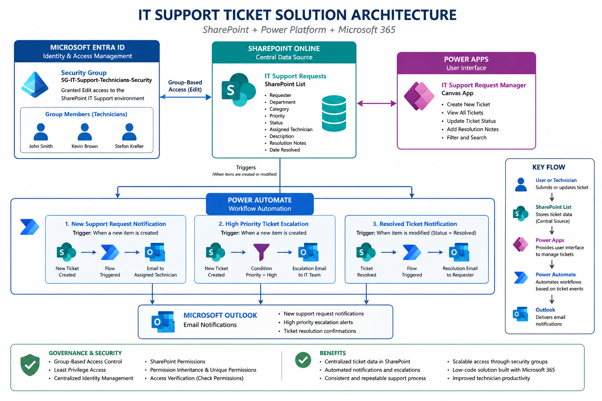
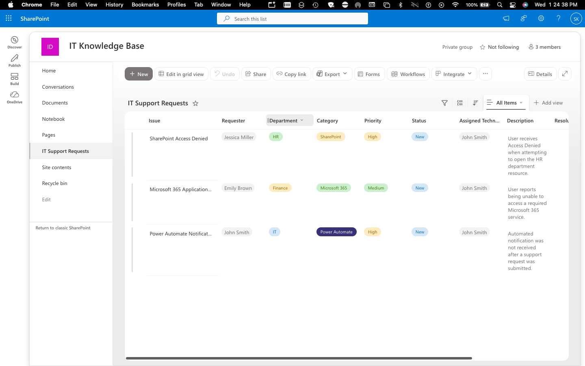
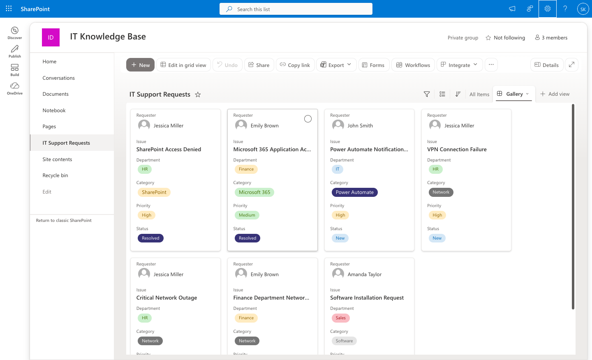
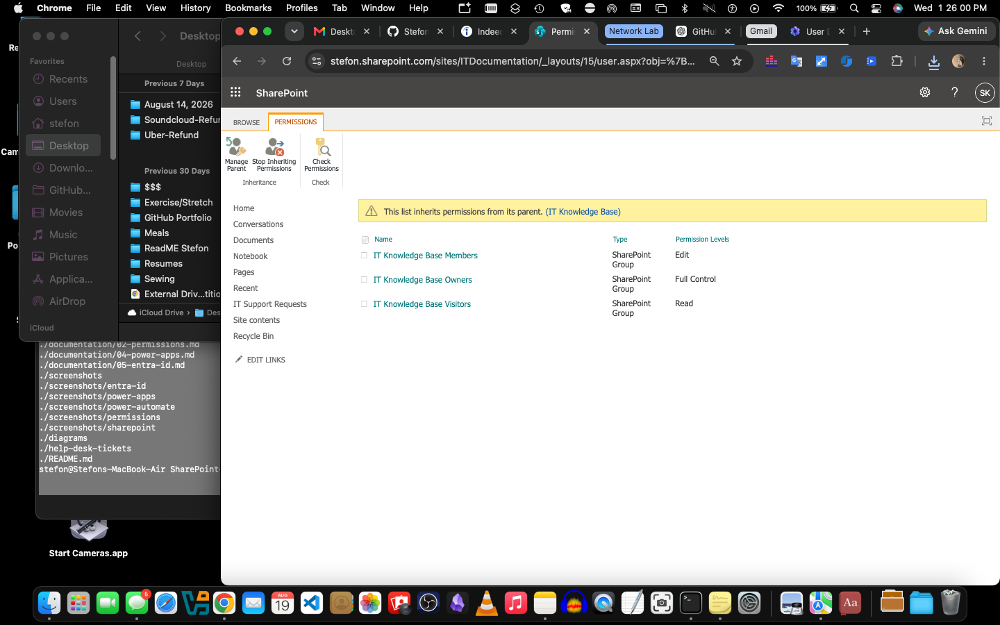
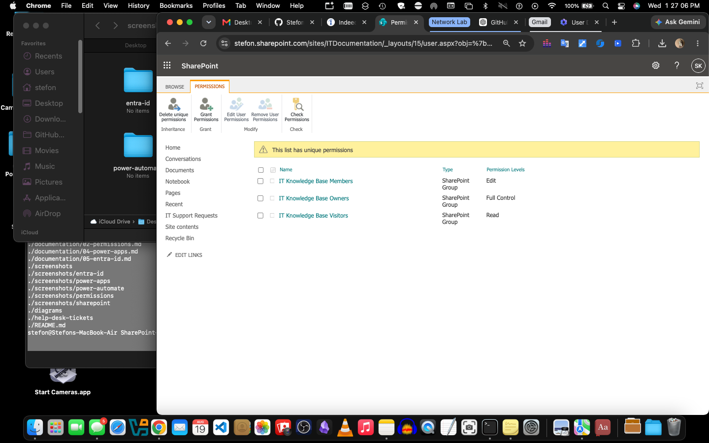
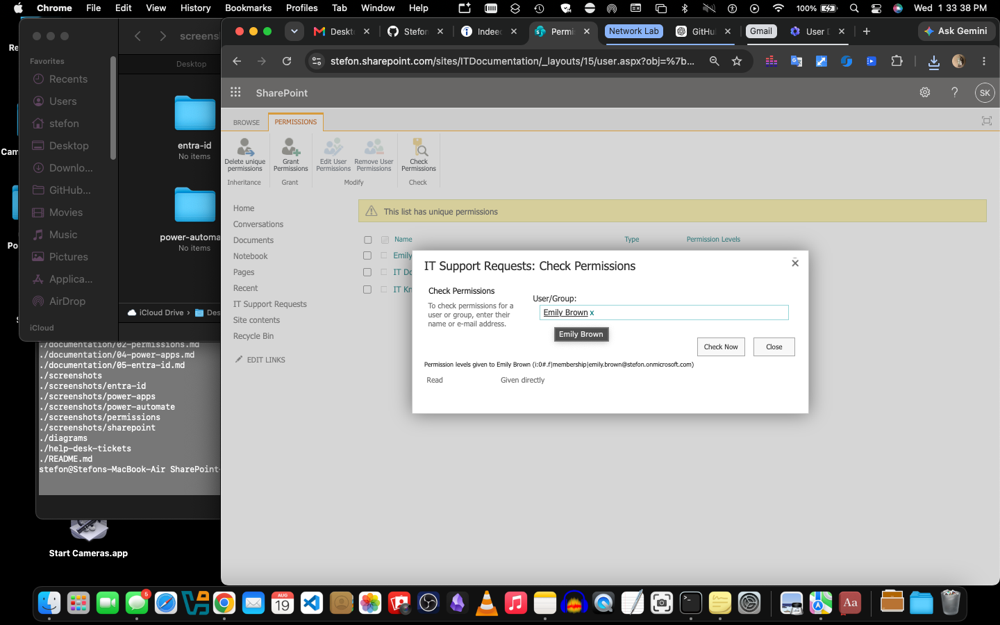
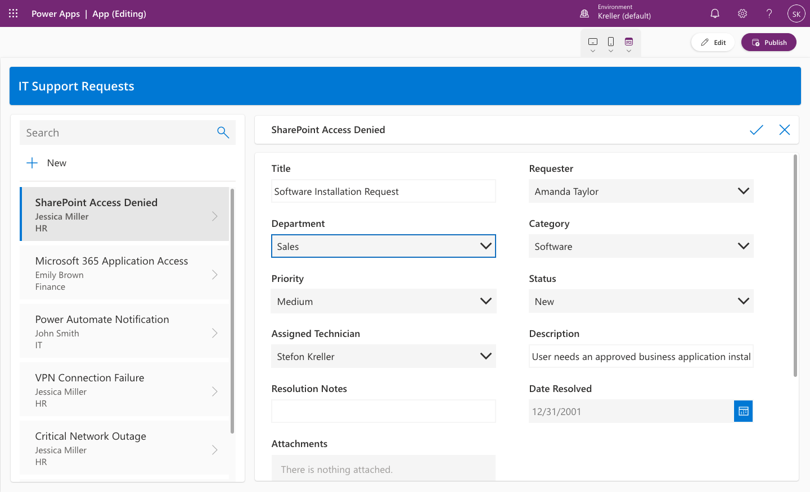
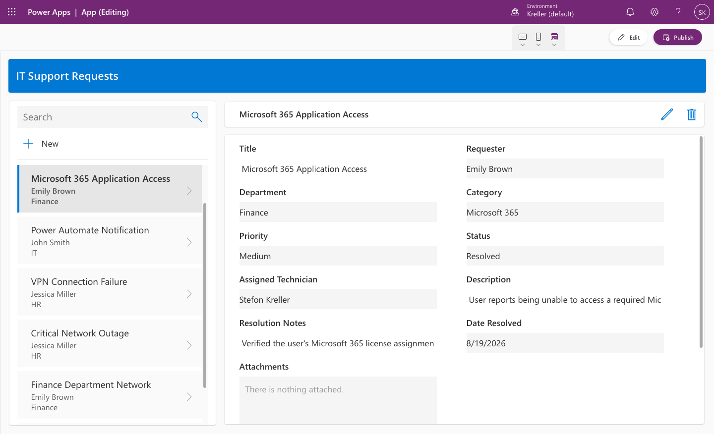
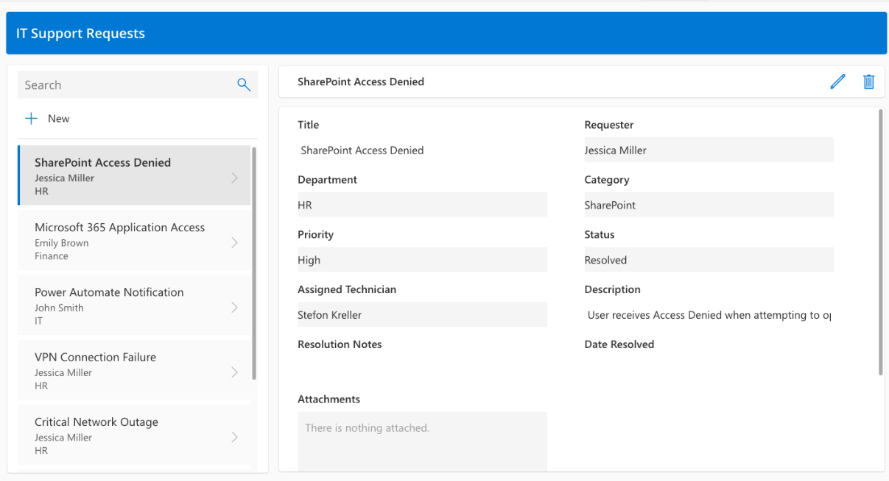
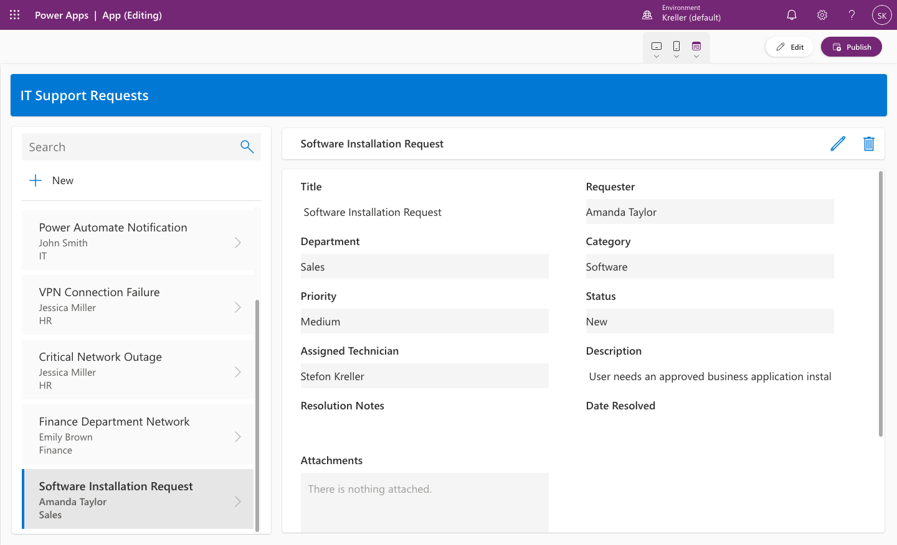

# SharePoint + Power Platform Support Lab

## Overview

This project demonstrates a hands-on Microsoft support environment built with SharePoint Online, Power Automate, Power Apps, Microsoft Entra ID, and Outlook.

The lab simulates a small IT support workflow where users submit support requests, technicians manage and resolve tickets, high-priority incidents are automatically escalated, and requesters receive status notifications.

The project was designed to demonstrate practical skills used in Microsoft 365 support, SharePoint administration, Power Platform support, permissions management, workflow automation, and technical troubleshooting.

---

## Technologies Used

* Microsoft SharePoint Online
* Microsoft Power Automate
* Microsoft Power Apps
* Microsoft Entra ID
* Microsoft 365
* Outlook
* GitHub
* Visual Studio Code

---

# Project Architecture

### Architecture Diagram



```text
Microsoft Entra ID
       │
       ├── Users
       └── Groups
            │
            ▼
SharePoint Online
IT Support Requests List
       │
       ├──────────────► Power Apps
       │                IT Support Request Manager
       │
       └──────────────► Power Automate
                         │
                         ├── New Ticket Notification
                         ├── High Priority Escalation
                         └── Resolution Notification
                                  │
                                  ▼
                             Outlook Email
```

---

# SharePoint IT Support Requests

A SharePoint list was created to act as the central data source for IT support tickets.

The list tracks:

* Issue
* Requester
* Department
* Category
* Priority
* Status
* Assigned Technician
* Description
* Resolution Notes
* Date Resolved

Example categories include:

* Account Access
* Microsoft 365
* Hardware
* Software
* Network
* Other

Example priorities include:

* Low
* Medium
* High
* Critical

Example ticket statuses include:

* New
* In Progress
* Waiting on User
* Resolved
* Closed

### Screenshot



### SharePoint IT Support Request Gallery

The gallery view provides a visual overview of active and resolved support requests, including requester, department, category, priority, and status.



---

# SharePoint Permissions

The IT Support Requests list was initially configured to inherit permissions from its parent SharePoint site.

Permission inheritance was then disabled to allow the list to use its own access controls.

The permission configuration demonstrated:

* Inherited SharePoint permissions
* Unique list permissions
* Removal of unnecessary visitor access
* Direct user permission assignment
* Least-privilege access
* Permission verification

A test user was granted Read access while SharePoint Members retained Edit access and Owners retained Full Control.

## Permissions Evidence

### Inherited Permissions



### Unique Permissions



### Visitor Access Removed


### Read Access Granted


### Permission Verification



---

# Power Automate

Three Power Automate workflows were created to automate the IT support process.

---

## Flow 01 — Support Request Notification

### Purpose

Automatically notify the assigned technician whenever a new IT support request is created.

### Workflow

```text
New SharePoint Item
        │
        ▼
When an item is created
        │
        ▼
Send an email (V2)
        │
        ▼
Assigned Technician
```

The email dynamically includes:

* Ticket issue
* Requester
* Department
* Category
* Priority
* Status
* Description

During testing, the flow initially failed because the SharePoint Person field returned a claims value instead of an email address.

The issue was diagnosed and corrected by using the Assigned Technician Email property.

This provided a real troubleshooting example involving SharePoint Person fields and Power Automate dynamic content.

Screenshots for this workflow are stored in:

```text
screenshots/power-automate/01-support-request-notification/
```

---

## Flow 02 — High Priority Ticket Escalation

### Purpose

Automatically escalate tickets when the ticket Priority is set to High.

### Workflow

```text
New SharePoint Item
        │
        ▼
Condition
Priority = High
      /     \
   True     False
    │
    ▼
Send Escalation Email
```

The condition evaluates the SharePoint Priority field.

If Priority equals High, Power Automate sends an escalation email containing:

* Issue
* Requester
* Department
* Category
* Priority
* Assigned Technician
* Description

This flow demonstrates:

* Conditional logic
* Dynamic SharePoint data
* Automated escalation
* Email notifications

Screenshots for this workflow are stored in:

```text
screenshots/power-automate/02-high-priority-escalation/
```

---

## Flow 03 — Ticket Status Notification

### Purpose

Automatically notify the requester when their IT support ticket is resolved.

### Workflow

```text
SharePoint Item Modified
        │
        ▼
Condition
Status = Resolved
      /        \
   True        False
    │
    ▼
Send Resolution Email
```

The resolution email dynamically includes:

* Issue
* Status
* Assigned Technician
* Resolution Notes
* Date Resolved

This flow demonstrates event-based automation using updates to existing SharePoint items.

Screenshots for this workflow are stored in:

```text
screenshots/power-automate/03-ticket-status-notification/
```

---

# Power Apps

A Power Apps application was created using the SharePoint IT Support Requests list as the data source.

## Application Name

**IT Support Request Manager**

## Purpose

The application provides technicians with a simplified interface for managing IT support requests without working directly inside the SharePoint list.

The app allows technicians to:

* View tickets
* Search support requests
* Create new tickets
* Edit existing tickets
* Assign technicians
* Change ticket status
* Add resolution notes
* Record resolution dates
* Review ticket details

SharePoint Person fields were configured to display user Display Names instead of SharePoint claims strings.

The Date Resolved field was also adjusted so unresolved tickets do not display an incorrect default date.

## Power Apps Evidence

### New Ticket Form



### Resolved Ticket



### Ticket Dashboard



### New Ticket Saved



---

# Example Support Scenarios

The environment was tested with simulated support incidents including:

* SharePoint access denied
* Microsoft 365 application access
* Power Automate notification failure
* VPN connection failure
* Finance department network outage
* Software installation request
* High-priority ticket escalation
* Resolved-ticket notification

These scenarios were used to validate SharePoint, Power Automate, Power Apps, permissions, and Outlook integration.

---

# Troubleshooting Experience

This lab included several real troubleshooting situations during implementation.

## Power Automate Person Field Error

A notification flow failed because the SharePoint Assigned Technician field returned a claims value similar to:

```text
i:0#.f|membership|user@tenant.onmicrosoft.com
```

Power Automate required the technician's actual email address.

The flow was corrected by using the SharePoint Person field's Email property.

After the correction, the flow completed successfully and delivered the expected Outlook notification.

---

## Power Automate Condition Troubleshooting

The High Priority escalation workflow initially evaluated the condition incorrectly.

The Priority field was corrected to use SharePoint dynamic content:

```text
Priority Value = High
```

A new High-priority ticket was created and the workflow successfully followed the True branch and sent an escalation email.

---

## Power Apps Person Field Display

Requester and Assigned Technician controls originally displayed SharePoint membership claims values.

The Combo Box configuration was updated to use:

```text
DisplayName
```

for both primary text and search.

This resulted in readable user names being displayed throughout the application.

---

## Power Apps Date Field

Unresolved support requests displayed an incorrect default Date Resolved value.

The Date Resolved control was adjusted so the date is hidden when no actual resolution date exists.

Resolved tickets continue to display their stored resolution dates correctly.

---

# Skills Demonstrated

* SharePoint Online Administration
* SharePoint Lists
* SharePoint Permissions
* Permission Inheritance
* Least-Privilege Access
* Microsoft Power Automate
* Workflow Automation
* Conditional Logic
* Automated Email Notifications
* Microsoft Power Apps
* Canvas Apps
* SharePoint Data Integration
* Microsoft Entra ID
* Identity and Access Management
* Microsoft 365 Administration
* Outlook Integration
* Help Desk Troubleshooting
* Incident Management
* Technical Documentation
* Root Cause Analysis

---

# Key Results

This project demonstrates an end-to-end Microsoft support workflow:

```text
User submits support request
        │
        ▼
SharePoint stores the ticket
        │
        ▼
Power Apps provides technician interface
        │
        ▼
Power Automate processes ticket events
        │
        ├── Technician Notification
        ├── High Priority Escalation
        └── Resolution Notification
        │
        ▼
Outlook delivers automated notifications
```

The environment demonstrates how SharePoint, Power Apps, Power Automate, Microsoft 365 identity, and Outlook can be combined to create and support a practical IT service workflow.

---

# Lessons Learned

This lab strengthened my understanding of how Microsoft cloud services interact with one another.

Key lessons included:

* How SharePoint permissions inheritance affects access
* How to apply unique permissions and least-privilege access
* How SharePoint Person fields behave inside Power Automate and Power Apps
* How to use dynamic content in Power Automate
* How to troubleshoot failed workflow runs
* How to use conditional logic for escalation workflows
* How to connect Power Apps to SharePoint
* How to customize generated Power Apps controls
* How automated notifications can improve an IT support workflow
* How to document technical troubleshooting and resolutions for a portfolio project

---

# Repository Structure

```text
SharePoint-Power-Platform-Support-Lab/
│
├── README.md
│
├── documentation/
│   ├── 01-sharepoint-list.md
│   ├── 02-permissions.md
│   ├── 03-power-automate.md
│   ├── 04-power-apps.md
│   ├── 05-entra-id.md
│   └── 06-governance.md
│
├── screenshots/
│   ├── sharepoint/
│   ├── permissions/
│   ├── power-automate/
│   │   ├── 01-support-request-notification/
│   │   ├── 02-high-priority-escalation/
│   │   └── 03-ticket-status-notification/
│   ├── power-apps/
│   └── entra-id/
│
├── diagrams/
│
└── help-desk-tickets/
```

---

# Project Status

**SharePoint configuration:** Complete
**SharePoint permissions:** Complete
**Power Automate workflows:** Complete
**Power Apps application:** Complete
**Power Apps application published:** Complete
**Entra ID documentation:** In Progress
**Governance documentation:** In Progress
**Help desk ticket documentation:** In Progress
**Architecture diagram:** In Progress
