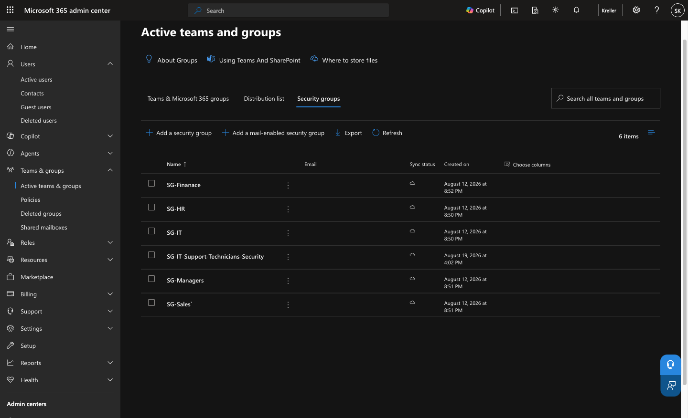
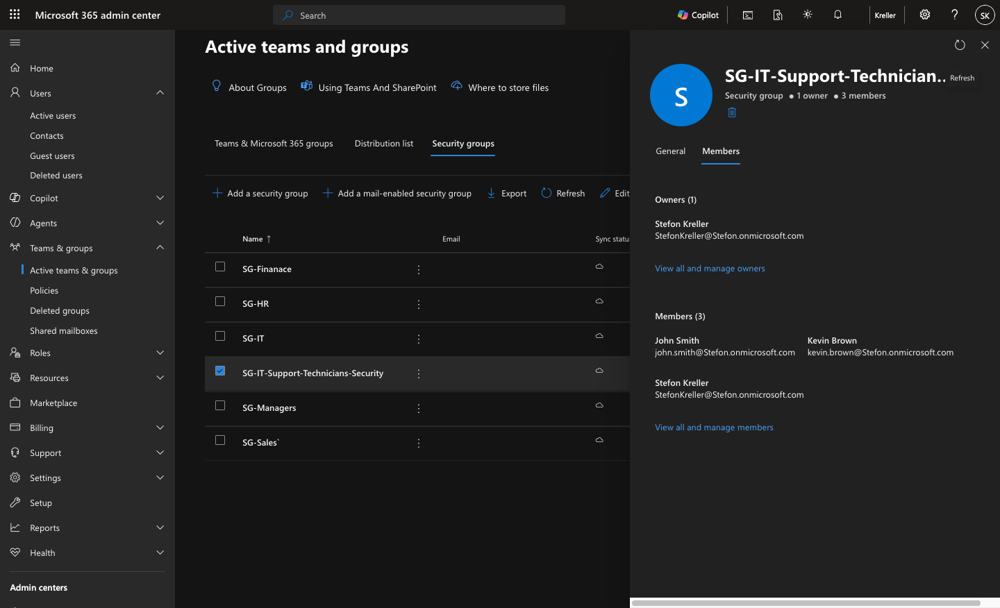
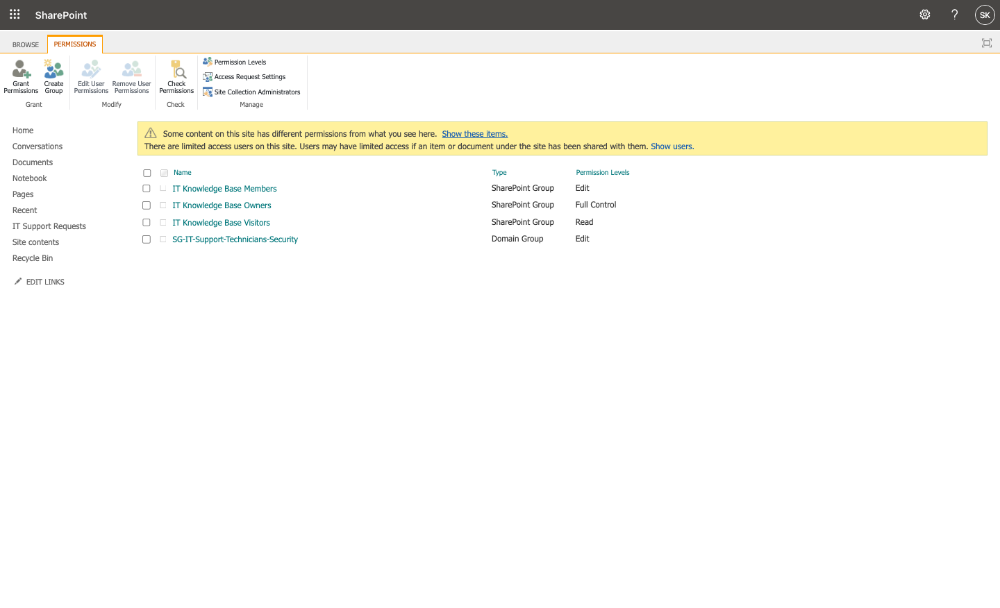
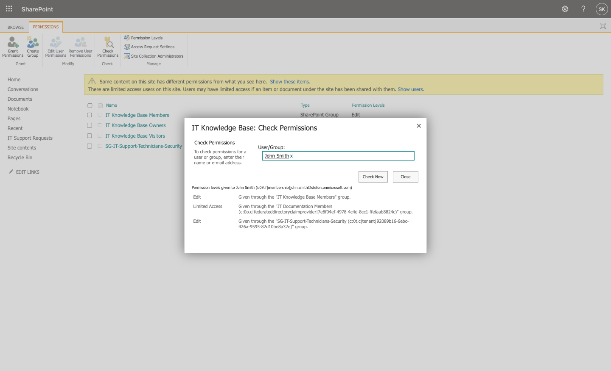

# Microsoft Entra ID — Identity & Access Management

## Overview

Microsoft Entra ID was used to implement group-based access control for the IT support environment.

Rather than assigning SharePoint permissions individually to each technician, a dedicated security group was created for IT support personnel. Permissions were then assigned to the group and inherited by its members.

This demonstrates a scalable approach to identity and access management.

---

## Security Group

A dedicated security group was created:

**Group Name:** `SG-IT-Support-Technicians-Security`

**Group Type:** Security Group

**Purpose:** Manage technician access to IT support resources and related Microsoft 365 services.

### Security Group



---

## Group Membership

Three lab users were assigned to the security group:

- John Smith
- Kevin Brown
- Stefon Kreller

Using group membership allows technician access to be managed centrally.

For example, a new technician can be granted access by adding the account to the security group rather than manually configuring permissions on each resource.

### Group Members



---

## SharePoint Access Assignment

The security group was granted **Edit** permissions to the SharePoint environment containing the IT Support Requests system.

The permission configuration was:

| Identity | Type | Permission |
|---|---|---|
| SG-IT-Support-Technicians-Security | Domain Group | Edit |

This allows members of the technician security group to work with the SharePoint resources required for IT support operations.

### SharePoint Permission Assignment



---

## Effective Permission Verification

Access was verified using SharePoint's **Check Permissions** feature.

**Test User:** John Smith

John Smith was a member of:

`SG-IT-Support-Technicians-Security`

SharePoint confirmed that the user received **Edit** permission through the security group.

### Permission Verification



This verified that group-based access was functioning as intended.

---

## Access Control Model

The resulting access model was:

```text
Microsoft Entra ID
        │
        ▼
SG-IT-Support-Technicians-Security
        │
        ├── John Smith
        ├── Kevin Brown
        └── Stefon Kreller
        │
        ▼
SharePoint
        │
        ▼
Edit Permission
        │
        ▼
IT Support Resources
```

Instead of managing SharePoint access separately for every technician, access can be controlled through Entra ID group membership.

---

## Principle of Group-Based Access

This lab uses the following administration model:

```text
User
  │
  ▼
Security Group
  │
  ▼
Permission
  │
  ▼
Resource
```

This provides a more manageable access-control structure than assigning permissions directly to individual users.

For example:

### Technician Onboarding

```text
New Technician
      │
      ▼
Add to
SG-IT-Support-Technicians-Security
      │
      ▼
Receives Required SharePoint Access
```

### Technician Offboarding

```text
Departing Technician
      │
      ▼
Remove from
SG-IT-Support-Technicians-Security
      │
      ▼
Group-Based SharePoint Access Removed
```

---

## Integration with the Support Environment

The security group complements the other components of the support lab:

```text
Microsoft Entra ID
Identity & Group Membership
        │
        ▼
SharePoint Online
Permissions & Ticket Data
        │
        ▼
Power Apps
Ticket Management Interface
        │
        ▼
Power Automate
Workflow Automation
        │
        ▼
Outlook
Email Notifications
```

Each Microsoft service performs a different role within the support environment.

**Entra ID** manages identity and group membership.

**SharePoint** stores support-ticket data and controls resource permissions.

**Power Apps** provides the technician-facing ticket interface.

**Power Automate** processes ticket events and notifications.

**Outlook** delivers automated support communications.

---

## Skills Demonstrated

- Microsoft Entra ID
- Identity and Access Management (IAM)
- Security Groups
- Group Membership Management
- Role-Based Access Concepts
- SharePoint Online Permissions
- Group-Based Access Control
- Effective Permission Verification
- User Access Administration
- Microsoft 365 Administration
- Power Platform Integration
- IT Support Administration
- Access Control Troubleshooting
- Technical Documentation

---

## Result

A dedicated Microsoft Entra security group was successfully used to manage technician access to the SharePoint support environment.

SharePoint's permission verification confirmed that a technician received **Edit** access through membership in the security group.

This demonstrates an identity-based access model in which administrative access can be managed centrally through group membership rather than through individual permission assignments.